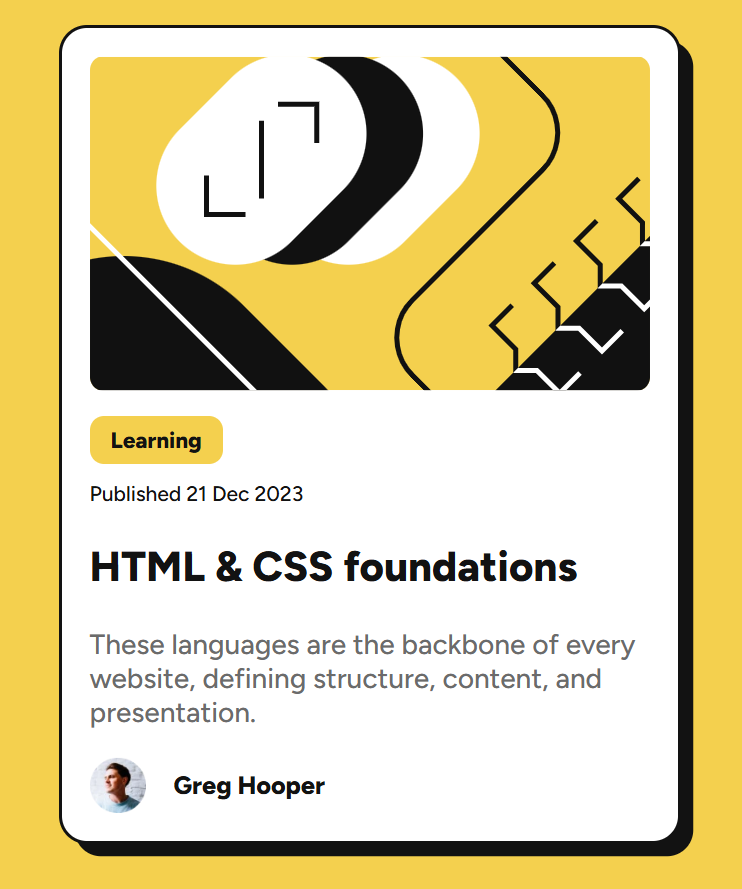

# Frontend Mentor - Blog preview card solution

This is a solution to the [Blog preview card challenge on Frontend Mentor](https://www.frontendmentor.io/challenges/blog-preview-card-ckPaj01IcS). Frontend Mentor challenges help you improve your coding skills by building realistic projects. 

## Table of contents

- [Frontend Mentor - Blog preview card solution](#frontend-mentor---blog-preview-card-solution)
  - [Table of contents](#table-of-contents)
  - [Overview](#overview)
    - [The challenge](#the-challenge)
    - [Screenshot](#screenshot)
    - [Links](#links)
  - [My process](#my-process)
    - [Built with](#built-with)
    - [What I learned](#what-i-learned)
  - [Author](#author)

## Overview

### The challenge

Users should be able to:

- See hover and focus states for all interactive elements on the page

### Screenshot

### Links

- Solution URL: [Solution URL here](https://github.com/radosvet93/fm-blog-preview-card)
- Live Site URL: [Live site URL here](https://radosvet93.github.io/fm-blog-preview-card/)

## My process

### Built with

- Semantic HTML5 markup
- CSS custom properties
- Flexbox
- CSS Grid
- Mobile-first workflow

### What I learned

- [Live Server VS code extension](https://marketplace.visualstudio.com/items?itemName=ms-vscode.live-server) - nice extension to see live changes without leaving VScode, very useful for when working with plain HTML and CSS files

## Author

- Website - [Radosvet Petrov](https://www.radosvet.dev)
- Frontend Mentor - [@radosvet93](https://www.frontendmentor.io/profile/radosvet93)
